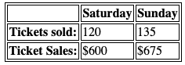

[Class07](https://cassandraortiz.github.io/reading-notes/Class07/class07) \| [Functions, Methods & Objects *(pgs 126-145)*](https://cassandraortiz.github.io/reading-notes/Class07/class07_funcMethObj) \| [Domain Modeling](https://cassandraortiz.github.io/reading-notes/Class07/class07_article)

# Tables  *(pgs 126-145)*

Tables represent inforamtion in a grid format. Complex data is displayed on two axes. Each block is referred to as a **table cell.**

```html

<table> <!-- this creates the table -->
    <tr> <!-- table row -->
        <th></th> <!-- table header (blank)-->
        <th scope="col">Saturday</th> <!-- col. heading -->
        <th scope="col">Sunday</th>
    </tr>
    <tr> <!-- table row -->
        <th scope="row">Tickets sold:</th> <!-- row header -->
        <td>120</td> <!-- table data -->
        <td>135</th>
    </tr>
    <tr> <!-- table row -->
        <th scope="row">Ticket Sales:</th> <!-- row header -->
        <td>$600</td> <!-- table data -->
        <td>$675</th>
    </tr>
</table>

```



## Long Tables

Long tables have three elements to them; head, body and foot. 
Headers should sit within `<thead>` tags, `<tbody>` for the table body/data elements and `<tfoot>` for the footer/total row.

## Spanning

Sometimes it's necessary to span data through a few columns/rows.  To do this, you will set an attribute in either the `<th>` or the `<td>` elements.

---

[HOME](https://cassandraortiz.github.io/reading-notes)